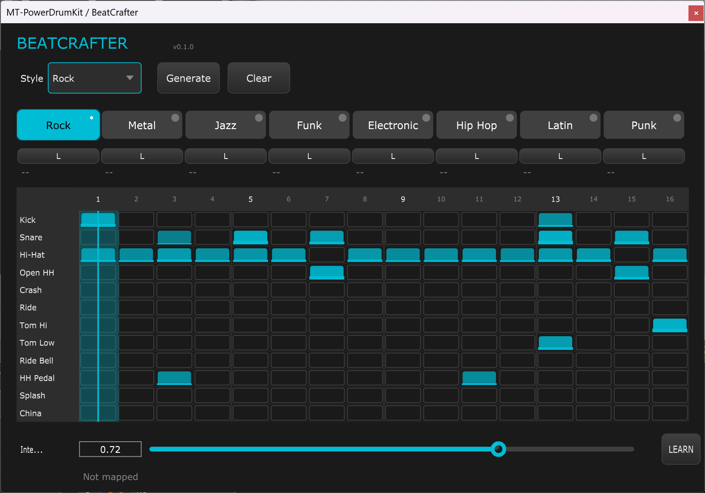

# 🥁 BeatCrafter

**Intelligent MIDI Drum Pattern Generator VST3 - Proof of Concept**


## 🎯 Concept Overview

**BeatCrafter is a proof of concept** for an intelligent MIDI drum pattern generator designed specifically for **live performance with foot controller**. The plugin generates only MIDI data - no audio - making it perfect for triggering your favorite drum VSTs like MT Power Drum Kit, Superior Drummer, or any General MIDI drum sampler.

The core philosophy: start simple and build complexity musically. Patterns begin with minimal elements (snare only on beat 3) and progressively evolve into full arrangements as intensity increases, respecting the authentic characteristics of each musical style.



## ✨ Features
- 🎛️ **8 Pattern Slots** - Switch patterns live with foot controller during performance
- 🎚️ **Dynamic Intensity Control** - Morph patterns from simple to complex (0-100%)
- 🎸 **8 Music Styles** - Rock, Metal, Jazz, Funk, Electronic, HipHop, Latin, Punk
- 🎹 **Visual Pattern Editor** - 16-step grid with velocity visualization
- 🎯 **Style-Aware Generation** - Each style follows authentic rhythmic rules
- 🎮 **MIDI Learn** - Map intensity and slot changes to any MIDI controller
- 🦶 **Foot Controller Ready** - Designed for hands-free live performance
- 📡 **MIDI Output Only** - Routes to any drum VST or hardware
- 🎧 **MIDI Export** - Ctrl+click to drag patterns directly into your DAW

## 🚧 Development Status

This is a **proof of concept** with ongoing work on:

- ⚠️ **Rhythmic Coherence** - Improving musical authenticity of generated patterns
- 🎵 **Style Refinement** - Better characteristic patterns for each genre
- 🥁 **Cymbal Logic** - More realistic hi-hat/ride/splash combinations
- 🎛️ **Performance Stability** - Live performance optimization

## 🚀 Quick Start

### Build from Source

```bash
# Clone the repo
git clone https://github.com/innermost47/beatcrafter.git
cd beatcrafter
cmake -B build && cd build
cmake --build . --config Release
```

## 🎮 Workflow Example (Bitwig Studio)

1. **Load BeatCrafter** as a MIDI effect on a track
2. **Add MT Power Drum Kit** (or any drum VST) after BeatCrafter in the chain
3. **Choose a style** from the dropdown (Rock, Metal, Jazz, etc.)
4. **Generate patterns** or create custom ones
5. **Map foot controller** to intensity slider and slot buttons via MIDI Learn
6. **Perform live** - change intensity and switch patterns with your feet!

## 🎛️ Intensity Progression

Each style follows its own musical evolution:

- **0-30%**: Minimal pattern (snare on beat 3 only)
- **30-50%**: Classic backbeat (snare on beats 2 & 4)
- **50-70%**: Added complexity (ghost notes, double kicks)
- **70-85%**: High energy (fills, off-beats, accents)
- **85-100%**: Maximum intensity (blast beats for metal, complex jazz comping)

## 🥁 General MIDI Drum Map

| Instrument | MIDI Note | Note Name |
| ---------- | --------- | --------- |
| Kick       | 36        | C1        |
| Snare      | 38        | D1        |
| Hi-Hat     | 42        | F#1       |
| Open HH    | 46        | A#1       |
| Crash      | 49        | C#2       |
| Ride       | 51        | D#2       |
| Tom Hi     | 50        | D2        |
| Tom Low    | 45        | A1        |
| Ride Bell  | 53        | F2        |
| HH Pedal   | 44        | G#1       |
| Splash     | 57        | A2        |
| China      | 52        | E2        |

## 🎹 MIDI Learn

- Click **"LEARN"** next to intensity slider → move your foot controller
- Click **"L"** under any slot → press the corresponding foot switch
- All mappings saved with your project

## 🛠️ Requirements

- CMake 3.22+
- C++17 compiler
- VST3 SDK (downloaded automatically via JUCE)
- A drum VST (MT Power Drum Kit recommended for testing)

## 🎪 Use Cases

- **Live Performance** - Hands-free drum track control
- **Home Studio** - Quick authentic drum parts
- **Songwriting** - Rapid pattern prototyping
- **Practice** - Dynamic backing tracks

## 🤝 Contributing

This is an open proof of concept! Pull requests welcome, especially for:

- Rhythmic pattern improvements
- New style implementations
- Performance optimizations
- UI/UX enhancements

## 📄 License

MIT License - see LICENSE file for details

## 🙏 Credits

Built with [JUCE Framework](https://juce.com/)

**Note**: BeatCrafter generates MIDI only. Pair it with quality drum samples for best results!
